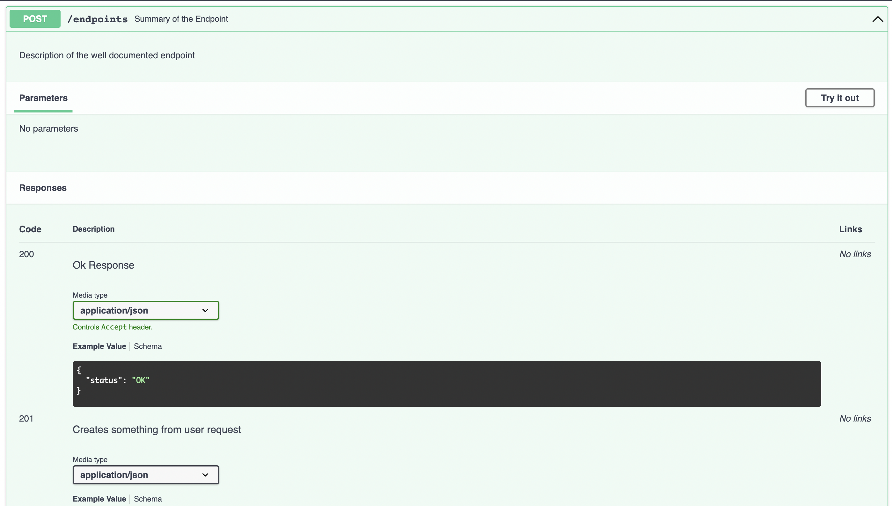

# FastAPI 最佳实践

**FastAPI Best Practices**

原文: <https://github.com/zhanymkanov/fastapi-best-practices>

=== "中文"

    以下是我在初创公司使用的最佳实践和惯例的主观列表。

    在过去几年的生产过程中，我们做出了一些好的和坏的决定，这些决定极大地影响了我们的开发人员体验。其中一些值得分享。
    
=== "英文"

    Opinionated list of best practices and conventions I use in startups.
    
    For the last several years in production, we have been making good and bad decisions that impacted our developer experience dramatically. Some of them are worth sharing. 

## 项目结构

**Project Structure**

=== "中文"

    有许多方法可以组织一个项目，但最好的结构是一致的、直接的，并且没有惊喜。
    
    许多示例项目和教程按文件类型（例如，crud、routers、models）划分项目，这对于微服务或范围较小的项目效果很好。然而，这种方法并不适合我们拥有许多领域和模块的单体应用。
    
    我发现对于这些情况更可扩展和可进化的结构是受 Netflix 的 Dispatch 启发的，有一些小的修改。
    
    ```plaintext
    fastapi-project
    ├── alembic/
    ├── src
    │   ├── auth
    │   │   ├── router.py
    │   │   ├── schemas.py  # pydantic模型
    │   │   ├── models.py  # 数据库模型
    │   │   ├── dependencies.py
    │   │   ├── config.py  # 本地配置
    │   │   ├── constants.py
    │   │   ├── exceptions.py
    │   │   ├── service.py
    │   │   └── utils.py
    │   ├── aws
    │   │   ├── client.py  # 外部服务通信的客户端模型
    │   │   ├── schemas.py
    │   │   ├── config.py
    │   │   ├── constants.py
    │   │   ├── exceptions.py
    │   │   └── utils.py
    │   └── posts
    │   │   ├── router.py
    │   │   ├── schemas.py
    │   │   ├── models.py
    │   │   ├── dependencies.py
    │   │   ├── constants.py
    │   │   ├── exceptions.py
    │   │   ├── service.py
    │   │   └── utils.py
    │   ├── config.py  # 全局配置
    │   ├── models.py  # 全局模型
    │   ├── exceptions.py  # 全局异常
    │   ├── pagination.py  # 全局模块，例如分页
    │   ├── database.py  # 数据库连接相关
    │   └── main.py
    ├── tests/
    │   ├── auth
    │   ├── aws
    │   └── posts
    ├── templates/
    │   └── index.html
    ├── requirements
    │   ├── base.txt
    │   ├── dev.txt
    │   └── prod.txt
    ├── .env
    ├── .gitignore
    ├── logging.ini
    └── alembic.ini
    ```
    
    1. 将所有领域目录存储在 `src` 文件夹内
    
        1. `src/` - 应用的最高层级，包含通用模型、配置和常量等。
        2. `src/main.py` - 项目的根，初始化 FastAPI 应用
    
    2. 每个包都有自己的路由器、模式、模型等。
    
        1. `router.py` - 每个模块的核心，包含所有端点
        2. `schemas.py` - 用于 pydantic 模型
        3. `models.py` - 用于数据库模型
        4. `service.py` - 模块特定的业务逻辑
        5. `dependencies.py` - 路由器依赖
        6. `constants.py` - 模块特定的常量和错误代码
        7. `config.py` - 例如环境变量
        8. `utils.py` - 非业务逻辑函数，例如响应标准化、数据丰富化等
        9. `exceptions.py` - 模块特定的异常，例如 `PostNotFound`, `InvalidUserData`
    
    3. 当包需要从其他包导入服务、依赖或常量时 - 使用显式的模块名称导入它们
    
    ```python
    from src.auth import constants as auth_constants
    from src.notifications import service as notification_service
    from src.posts.constants import ErrorCode as PostsErrorCode  # 如果我们在每个包的常量模块中有标准错误代码
    ```
    

=== "英文"

    There are many ways to structure a project, but the best structure is one that is consistent, straightforward, and free of surprises.
    
    Many example projects and tutorials divide the project by file type (e.g., crud, routers, models), which works well for microservices or projects with fewer scopes. However, this approach didn't fit our monolith with many domains and modules.
    
    The structure I found more scalable and evolvable for these cases is inspired by Netflix's Dispatch, with some minor modifications.
    
    ```text
    fastapi-project
    ├── alembic/
    ├── src
    │   ├── auth
    │   │   ├── router.py
    │   │   ├── schemas.py  # pydantic models
    │   │   ├── models.py  # db models
    │   │   ├── dependencies.py
    │   │   ├── config.py  # local configs
    │   │   ├── constants.py
    │   │   ├── exceptions.py
    │   │   ├── service.py
    │   │   └── utils.py
    │   ├── aws
    │   │   ├── client.py  # client model for external service communication
    │   │   ├── schemas.py
    │   │   ├── config.py
    │   │   ├── constants.py
    │   │   ├── exceptions.py
    │   │   └── utils.py
    │   └── posts
    │   │   ├── router.py
    │   │   ├── schemas.py
    │   │   ├── models.py
    │   │   ├── dependencies.py
    │   │   ├── constants.py
    │   │   ├── exceptions.py
    │   │   ├── service.py
    │   │   └── utils.py
    │   ├── config.py  # global configs
    │   ├── models.py  # global models
    │   ├── exceptions.py  # global exceptions
    │   ├── pagination.py  # global module e.g. pagination
    │   ├── database.py  # db connection related stuff
    │   └── main.py
    ├── tests/
    │   ├── auth
    │   ├── aws
    │   └── posts
    ├── templates/
    │   └── index.html
    ├── requirements
    │   ├── base.txt
    │   ├── dev.txt
    │   └── prod.txt
    ├── .env
    ├── .gitignore
    ├── logging.ini
    └── alembic.ini
    ```

    1. Store all domain directories inside `src` folder

        1. `src/` - highest level of an app, contains common models, configs, and constants, etc.
        2. `src/main.py` - root of the project, which inits the FastAPI app

    2. Each package has its own router, schemas, models, etc.

        1. `router.py` - is a core of each module with all the endpoints
        2. `schemas.py` - for pydantic models
        3. `models.py` - for db models
        4. `service.py` - module specific business logic  
        5. `dependencies.py` - router dependencies
        6. `constants.py` - module specific constants and error codes
        7. `config.py` - e.g. env vars
        8. `utils.py` - non-business logic functions, e.g. response normalization, data enrichment, etc.
        9. `exceptions.py` - module specific exceptions, e.g. `PostNotFound`, `InvalidUserData`

    3. When package requires services or dependencies or constants from other packages - import them with an explicit module name

    ```python
    from src.auth import constants as auth_constants
    from src.notifications import service as notification_service
    from src.posts.constants import ErrorCode as PostsErrorCode  # in case we have Standard ErrorCode in constants module of each package
    ```

## 异步路由

**Async Routes**

=== "中文"

    FastAPI 是一个异步框架，首先它是为异步 I/O 操作设计的，这也是它如此快速的原因。
    
    然而，FastAPI 并不限制你只能使用 `async` 路由，开发者也可以使用 `sync` 路由。这可能会让初级开发者误以为它们是一样的，但它们并非如此。
    

=== "英文"

    FastAPI is an async framework, in the first place. It is designed to work with async I/O operations and that is the reason it is so fast. 
    
    However, FastAPI doesn't restrict you to use only `async` routes, and the developer can use `sync` routes as well. This might confuse beginner developers into believing that they are the same, but they are not.

### I/O 密集型任务

**I/O Intensive Tasks**

=== "中文"

    在内部，FastAPI 可以有效地处理异步和同步 I/O 操作。
    
    - FastAPI 在 [线程池](https://en.wikipedia.org/wiki/Thread_pool) 中运行 `同步` 路由，并且阻塞 I/O 操作不会阻止 [事件循环](https://docs.python.org/3/library/asyncio-eventloop.html) 执行任务。
    - 如果路由定义为 `异步`，则通过 `await` 正常调用，FastAPI 相信你只会执行非阻塞 I/O 操作。
    
    需要注意的是，如果你违背了这种信任，在异步路由中执行阻塞操作，事件循环将无法在阻塞操作完成之前运行下一个任务。
    
    ```python
    import asyncio
    import time
    
    from fastapi import APIRouter
    
    router = APIRouter()
    
    @router.get("/terrible-ping")
    async def terrible_ping():
        time.sleep(10)  # 10秒的 I/O 阻塞操作，整个过程将被阻塞
        
        return {"pong": True}
    
    @router.get("/good-ping")
    def good_ping():
        time.sleep(10)  # 10秒的 I/O 阻塞操作，但在单独的线程中执行整个 `good_ping` 路由
    
        return {"pong": True}
    
    @router.get("/perfect-ping")
    async def perfect_ping():
        await asyncio.sleep(10)  # 非阻塞 I/O 操作
    
        return {"pong": True}
    ```
    
    **当我们调用时会发生什么：**
    
    1. `GET /terrible-ping`
    
       1. FastAPI 服务器接收到一个请求并开始处理它
       2. 服务器的事件循环和队列中的所有任务将等待 `time.sleep()` 完成
    
          1. 服务器认为 `time.sleep()` 不是一个 I/O 任务，所以它等待直到它完成
          2. 服务器在等待时不会接受任何新请求
    
       3. 服务器返回响应。 
    
          1. 响应后，服务器开始接受新请求
    
    2. `GET /good-ping`
    
       1. FastAPI 服务器接收到一个请求并开始处理它
       2. FastAPI 将整个路由 `good_ping` 发送到线程池，工作线程将运行该函数
       3. 虽然 `good_ping` 正在执行，事件循环从队列中选择下一个任务并处理它们（例如接受新请求，调用数据库）
    
          - 独立于主线程（即我们的 FastAPI 应用），
            工作线程将等待 `time.sleep` 完成。
          - 同步操作仅阻塞辅助线程，而不是主线程。
    
       4. 当 `good_ping` 完成工作时，服务器向客户端返回响应
    
    3. `GET /perfect-ping`
    
       1. FastAPI 服务器接收到一个请求并开始处理它
       2. FastAPI 等待 `asyncio.sleep(10)`
       3. 事件循环从队列中选择下一个任务并处理它们（例如接受新请求，调用数据库）
       4. 当 `asyncio.sleep(10)` 完成后，服务器完成路由的执行并向客户端返回响应
    
    > [!WARNING]
    > 关于线程池的注意事项：
    > - 线程比协程需要更多资源，因此它们不像异步 I/O 操作那样便宜。
    > - 线程池的线程数量有限，也就是说，你可能会用完线程，你的应用将变慢。[阅读更多](https://github.com/Kludex/fastapi-tips?tab=readme-ov-file#2-be-careful-with-non-async-functions)  (外部链接)
    

=== "英文"

    Under the hood, FastAPI can [effectively handle](https://fastapi.tiangolo.com/async/#path-operation-functions) both async and sync I/O operations. 
    
    - FastAPI runs `sync` routes in the [threadpool](https://en.wikipedia.org/wiki/Thread_pool)  and blocking I/O operations won't stop the [event loop](https://docs.python.org/3/library/asyncio-eventloop.html)  from executing the tasks. 
    - If the route is defined `async` then it's called regularly via `await`  and FastAPI trusts you to do only non-blocking I/O operations.
    
    The caveat is if you fail that trust and execute blocking operations within async routes,  the event loop will not be able to run the next tasks until that blocking operation is done.
    
    ```python
    import asyncio
    import time
    
    from fastapi import APIRouter
    
    
    router = APIRouter()
    
    
    @router.get("/terrible-ping")
    async def terrible_ping():
        time.sleep(10) # I/O blocking operation for 10 seconds, the whole process will be blocked
        
        return {"pong": True}
    
    @router.get("/good-ping")
    def good_ping():
        time.sleep(10) # I/O blocking operation for 10 seconds, but in a separate thread for the whole `good_ping` route
    
        return {"pong": True}
    
    @router.get("/perfect-ping")
    async def perfect_ping():
        await asyncio.sleep(10) # non-blocking I/O operation
    
        return {"pong": True}
    
    ```
    
    **What happens when we call:**
    
    1. `GET /terrible-ping`
    
       1. FastAPI server receives a request and starts handling it 
       2. Server's event loop and all the tasks in the queue will be waiting until `time.sleep()` is finished
    
          1. Server thinks `time.sleep()` is not an I/O task, so it waits until it is finished
          2. Server won't accept any new requests while waiting
    
       3. Server returns the response. 
    
          1. After a response, server starts accepting new requests
    
    2. `GET /good-ping`
    
       1. FastAPI server receives a request and starts handling it
       2. FastAPI sends the whole route `good_ping` to the threadpool, where a worker thread will run the function
       3. While `good_ping` is being executed, event loop selects next tasks from the queue and works on them (e.g. accept new request, call db)
    
          - Independently of main thread (i.e. our FastAPI app), 
            worker thread will be waiting for `time.sleep` to finish.
          - Sync operation blocks only the side thread, not the main one.
    
       4. When `good_ping` finishes its work, server returns a response to the client
    
    3. `GET /perfect-ping`
    
       1. FastAPI server receives a request and starts handling it
       2. FastAPI awaits `asyncio.sleep(10)`
       3. Event loop selects next tasks from the queue and works on them (e.g. accept new request, call db)
       4. When `asyncio.sleep(10)` is done, servers finishes the execution of the route and returns a response to the client
    
    > [!WARNING]
    > Notes on the thread pool:
    > - Threads require more resources than coroutines, so they are not as cheap as async I/O operations.
    > - Thread pool has a limited number of threads, i.e. you might run out of threads and your app will become slow. [Read more](https://github.com/Kludex/fastapi-tips?tab=readme-ov-file#2-be-careful-with-non-async-functions) (external link)

### CPU 密集型任务

**CPU Intensive Tasks**

=== "中文"
    
    第二个注意事项是，非阻塞的 awaitable 操作或发送到线程池的操作必须是 I/O 密集型任务（例如打开文件、数据库调用、外部 API 调用）。
    
    - 等待 CPU 密集型任务（例如繁重的计算、数据处理、视频转码）是没有意义的，因为 CPU 必须工作以完成任务，而 I/O 操作是外部的，服务器在等待这些操作完成时什么也不做，因此它可以进行下一个任务。
    - 在其他线程中运行 CPU 密集型任务也是无效的，因为 [GIL](https://realpython.com/python-gil/) 的存在。简而言之，GIL 只允许一个线程一次工作，这使得它对 CPU 任务毫无用处。
    - 如果你想要优化 CPU 密集型任务，你应该将它们发送到另一个进程中的工作器。
    
    **相关 StackOverflow 上困惑用户的提问**
    
    1. [Flask 与 FastAPI 的架构对比](https://stackoverflow.com/questions/62976648/architecture-flask-vs-fastapi/70309597#70309597) 
    
        - 在这里，你也可以查看[我的回答](https://stackoverflow.com/a/70309597/6927498) 
    
    2. [FastAPI UploadFile 比 Flask 慢](https://stackoverflow.com/questions/65342833/fastapi-uploadfile-is-slow-compared-to-flask)
    3. [FastAPI 运行 API 调用是串行而不是并行](https://stackoverflow.com/questions/71516140/fastapi-runs-api-calls-in-serial-instead-of-parallel-fashion)
    

=== "英文"
    
    The second caveat is that operations that are non-blocking awaitables or are sent to the thread pool must be I/O intensive tasks (e.g. open file, db call, external API call).
    
    - Awaiting CPU-intensive tasks (e.g. heavy calculations, data processing, video transcoding) is worthless since the CPU has to work to finish the tasks,  while I/O operations are external and server does nothing while waiting for that operations to finish, thus it can go to the next tasks.
    - Running CPU-intensive tasks in other threads also isn't effective, because of [GIL](https://realpython.com/python-gil/).  In short, GIL allows only one thread to work at a time, which makes it useless for CPU tasks. 
    - If you want to optimize CPU intensive tasks you should send them to workers in another process.
    
    **Related StackOverflow questions of confused users**
    
    1. https://stackoverflow.com/questions/62976648/architecture-flask-vs-fastapi/70309597#70309597
    
        - Here you can also check [my answer](https://stackoverflow.com/a/70309597/6927498)
    
    2. https://stackoverflow.com/questions/65342833/fastapi-uploadfile-is-slow-compared-to-flask
    3. https://stackoverflow.com/questions/71516140/fastapi-runs-api-calls-in-serial-instead-of-parallel-fashion

## Pydantic

**Pydantic**

### 常使用 Pydantic

**Excessively use Pydantic**

=== "中文"

    Pydantic 提供了丰富的功能来验证和转换数据。
    
    除了像必填和非必填字段以及带有默认值的常规特性外，Pydantic 还内置了全面的数据处理工具，如正则表达式、枚举、字符串操作、电子邮件验证等。
    
    ```python
    from enum import Enum
    from pydantic import AnyUrl, BaseModel, EmailStr, Field
    
    
    class MusicBand(str, Enum):
       AEROSMITH = "AEROSMITH"
       QUEEN = "QUEEN"
       ACDC = "AC/DC"
    
    
    class UserBase(BaseModel):
        first_name: str = Field(min_length=1, max_length=128)
        username: str = Field(min_length=1, max_length=128, pattern="^[A-Za-z0-9-_]+$")
        email: EmailStr
        age: int = Field(ge=18, default=None)  # 必须大于或等于 18
        favorite_band: MusicBand | None = None  # 只允许输入 "AEROSMITH", "QUEEN", "AC/DC" 的值
        website: AnyUrl | None = None
    ```
    

=== "英文"

    Pydantic has a rich set of features to validate and transform data. 

    In addition to regular features like required & non-required fields with default values,  Pydantic has built-in comprehensive data processing tools like regex, enums, strings manipulation, emails validation, etc.
    
    ```python
    from enum import Enum
    from pydantic import AnyUrl, BaseModel, EmailStr, Field
    
    
    class MusicBand(str, Enum):
       AEROSMITH = "AEROSMITH"
       QUEEN = "QUEEN"
       ACDC = "AC/DC"
    
    
    class UserBase(BaseModel):
        first_name: str = Field(min_length=1, max_length=128)
        username: str = Field(min_length=1, max_length=128, pattern="^[A-Za-z0-9-_]+$")
        email: EmailStr
        age: int = Field(ge=18, default=None)  # must be greater or equal to 18
        favorite_band: MusicBand | None = None  # only "AEROSMITH", "QUEEN", "AC/DC" values are allowed to be inputted
        website: AnyUrl | None = None
    ```

### 自定义基础模型

**Custom Base Model**

=== "中文"

    拥有一个可控制的全局基础模型允许我们自定义应用中的所有模型。例如，我们可以强制执行标准日期时间格式或为所有基础模型的子类引入一个通用方法。
    
    ```python
    from datetime import datetime
    from zoneinfo import ZoneInfo
    
    from fastapi.encoders import jsonable_encoder
    from pydantic import BaseModel, ConfigDict
    
    
    def datetime_to_gmt_str(dt: datetime) -> str:
        if not dt.tzinfo:
            dt = dt.replace(tzinfo=ZoneInfo("UTC"))
    
        return dt.strftime("%Y-%m-%dT%H:%M:%S%z")
    
    
    class CustomModel(BaseModel):
        model_config = ConfigDict(
            json_encoders={datetime: datetime_to_gmt_str},
            populate_by_name=True,
        )
    
        def serializable_dict(self, **kwargs):
            """返回一个只包含可序列化字段的字典。"""
            default_dict = self.model_dump()
    
            return jsonable_encoder(default_dict)
    ```
    
    在上面的例子中，我们决定创建一个全局基础模型，该模型：
    
    - 将所有 datetime 字段序列化为带有明确时区的标准格式
    - 提供一个方法，返回只包含可序列化字段的字典
    

=== "英文"

    Having a controllable global base model allows us to customize all the models within the app. For instance, we can enforce a standard datetime format or introduce a common method for all subclasses of the base model.

    ```python
    from datetime import datetime
    from zoneinfo import ZoneInfo
    
    from fastapi.encoders import jsonable_encoder
    from pydantic import BaseModel, ConfigDict
    
    
    def datetime_to_gmt_str(dt: datetime) -> str:
        if not dt.tzinfo:
            dt = dt.replace(tzinfo=ZoneInfo("UTC"))
    
        return dt.strftime("%Y-%m-%dT%H:%M:%S%z")
    
    
    class CustomModel(BaseModel):
        model_config = ConfigDict(
            json_encoders={datetime: datetime_to_gmt_str},
            populate_by_name=True,
        )
    
        def serializable_dict(self, **kwargs):
            """Return a dict which contains only serializable fields."""
            default_dict = self.model_dump()
    
            return jsonable_encoder(default_dict)
    
    
    ```

    In the example above, we have decided to create a global base model that:

    - Serializes all datetime fields to a standard format with an explicit timezone
    - Provides a method to return a dict with only serializable fields

### 解耦 Pydantic BaseSettings

**Decouple Pydantic BaseSettings**

=== "中文"

    `BaseSettings` 在读取环境变量方面是一项伟大的创新，但如果整个应用只有一个 `BaseSettings`，随着时间的推移可能会变得混乱。为了提高可维护性和组织性，我们可以将 `BaseSettings` 分散到不同的模块和领域中。
    
    ```python
    # src.auth.config
    from datetime import timedelta
    
    from pydantic_settings import BaseSettings
    
    
    class AuthConfig(BaseSettings):
        JWT_ALG: str
        JWT_SECRET: str
        JWT_EXP: int = 5  # minutes
    
        REFRESH_TOKEN_KEY: str
        REFRESH_TOKEN_EXP: timedelta = timedelta(days=30)
    
        SECURE_COOKIES: bool = True
    
    
    auth_settings = AuthConfig()
    
    
    # src.config
    from pydantic import PostgresDsn, RedisDsn, model_validator
    from pydantic_settings import BaseSettings
    
    from src.constants import Environment
    
    
    class Config(BaseSettings):
        DATABASE_URL: PostgresDsn
        REDIS_URL: RedisDsn
    
        SITE_DOMAIN: str = "myapp.com"
    
        ENVIRONMENT: Environment = Environment.PRODUCTION
    
        SENTRY_DSN: str | None = None
    
        CORS_ORIGINS: list[str]
        CORS_ORIGINS_REGEX: str | None = None
        CORS_HEADERS: list[str]
    
        APP_VERSION: str = "1.0"
    
    
    settings = Config()
    ```
    
    在上面的例子中，我们创建了两个不同的配置类：
    
    - `AuthConfig` 用于认证模块，包含了与 JWT 和刷新令牌相关的设置。
    - `Config` 用于整个应用，包含了数据库、缓存、环境、CORS 和版本等配置。
    
    这样做的好处是每个模块都有自己的配置类，使得配置的管理更加模块化和清晰。同时，每个配置类都可以独立地加载和验证其环境变量，有助于保持代码的整洁和可维护性。
    


=== "英文"

    BaseSettings was a great innovation for reading environment variables, but having a single BaseSettings for the whole app can become messy over time. To improve maintainability and organization, we have split the BaseSettings across different modules and domains.

    ```python
    # src.auth.config
    from datetime import timedelta
    
    from pydantic_settings import BaseSettings
    
    
    class AuthConfig(BaseSettings):
        JWT_ALG: str
        JWT_SECRET: str
        JWT_EXP: int = 5  # minutes
    
        REFRESH_TOKEN_KEY: str
        REFRESH_TOKEN_EXP: timedelta = timedelta(days=30)
    
        SECURE_COOKIES: bool = True
    
    
    auth_settings = AuthConfig()
    
    
    # src.config
    from pydantic import PostgresDsn, RedisDsn, model_validator
    from pydantic_settings import BaseSettings
    
    from src.constants import Environment
    
    
    class Config(BaseSettings):
        DATABASE_URL: PostgresDsn
        REDIS_URL: RedisDsn
    
        SITE_DOMAIN: str = "myapp.com"
    
        ENVIRONMENT: Environment = Environment.PRODUCTION
    
        SENTRY_DSN: str | None = None
    
        CORS_ORIGINS: list[str]
        CORS_ORIGINS_REGEX: str | None = None
        CORS_HEADERS: list[str]
    
        APP_VERSION: str = "1.0"
    
    
    settings = Config()
    
    ```
    

## 依赖

**Dependencies**

### 超越依赖注入

**Beyond Dependency Injection**

=== "中文"

    Pydantic 是一个很棒的模式验证器，但对于涉及调用数据库或外部服务的复杂验证来说，它是不够的。
    
    FastAPI 文档主要将依赖项呈现为端点的 DI（依赖注入），但它们也非常适合请求验证。
    
    依赖项可以用来根据数据库约束验证数据（例如，检查电子邮件是否已存在，确保找到了用户等）。
    
    ```python
    # dependencies.py
    async def valid_post_id(post_id: UUID4) -> dict[str, Any]:
        post = await service.get_by_id(post_id)
        if not post:
            raise HTTPException(status_code=404, detail="Post not found")
    
        return post
    
    
    # router.py
    @router.get("/posts/{post_id}", response_model=PostResponse)
    async def get_post_by_id(post: dict[str, Any] = Depends(valid_post_id)):
        return post
    
    
    @router.put("/posts/{post_id}", response_model=PostResponse)
    async def update_post(
        update_data: PostUpdate,  
        post: dict[str, Any] = Depends(valid_post_id), 
    ):
        updated_post = await service.update(id=post["id"], data=update_data)
        return updated_post
    
    
    @router.get("/posts/{post_id}/reviews", response_model=list[ReviewsResponse])
    async def get_post_reviews(post: dict[str, Any] = Depends(valid_post_id)):
        post_reviews = await reviews_service.get_by_post_id(post["id"])
        return post_reviews
    ```
    
    如果我们没有将数据验证放在依赖项中，我们将不得不为每个端点验证 `post_id` 的存在，并为它们每个编写相同的测试。通过将验证逻辑放在依赖项中，我们可以避免在每个路由处理函数中重复相同的验证代码，并且可以在一个地方集中处理错误，使得代码更加干净、易于维护，并且可以重用验证逻辑。
    
    此外，依赖项还可以用于执行跨多个端点的共享逻辑，例如身份验证、授权、日志记录等。这样可以确保每个请求都经过必要的预处理步骤，同时保持端点函数的简洁和专注。
    

=== "英文"

    Pydantic is a great schema validator, but for complex validations that involve calling a database or external services, it is not sufficient.

    FastAPI documentation mostly presents dependencies as DI for endpoints, but they are also excellent for request validation.
    
    Dependencies can be used to validate data against database constraints (e.g., checking if an email already exists, ensuring a user is found, etc.).
    
    ```python
    # dependencies.py
    async def valid_post_id(post_id: UUID4) -> dict[str, Any]:
        post = await service.get_by_id(post_id)
        if not post:
            raise PostNotFound()
    
        return post
    
    
    # router.py
    @router.get("/posts/{post_id}", response_model=PostResponse)
    async def get_post_by_id(post: dict[str, Any] = Depends(valid_post_id)):
        return post
    
    
    @router.put("/posts/{post_id}", response_model=PostResponse)
    async def update_post(
        update_data: PostUpdate,  
        post: dict[str, Any] = Depends(valid_post_id), 
    ):
        updated_post = await service.update(id=post["id"], data=update_data)
        return updated_post
    
    
    @router.get("/posts/{post_id}/reviews", response_model=list[ReviewsResponse])
    async def get_post_reviews(post: dict[str, Any] = Depends(valid_post_id)):
        post_reviews = await reviews_service.get_by_post_id(post["id"])
        return post_reviews
    ```
    
    If we didn't put data validation to dependency, we would have to validate `post_id` exists for every endpoint and write the same tests for each of them. 

### 依赖链

**Chain Dependencies**

=== "中文"
    
    依赖项可以使用其他依赖项，避免对类似逻辑的代码重复。
    
    ```python
    # dependencies.py
    from fastapi.security import OAuth2PasswordBearer
    from jose import JWTError, jwt
    
    async def valid_post_id(post_id: UUID4) -> dict[str, Any]:
        post = await service.get_by_id(post_id)
        if not post:
            raise HTTPException(status_code=404, detail="Post not found")
    
        return post
    
    
    async def parse_jwt_data(
        token: str = Depends(OAuth2PasswordBearer(tokenUrl="/auth/token"))
    ) -> dict[str, Any]:
        try:
            payload = jwt.decode(token, "JWT_SECRET", algorithms=["HS256"])
        except JWTError:
            raise HTTPException(status_code=401, detail="Invalid credentials")
    
        return {"user_id": payload["sub"]}
    
    
    async def valid_owned_post(
        post: dict[str, Any] = Depends(valid_post_id), 
        token_data: dict[str, Any] = Depends(parse_jwt_data),
    ) -> dict[str, Any]:
        if post["creator_id"] != token_data["user_id"]:
            raise HTTPException(status_code=403, detail="User is not the owner of the post")
    
        return post
    
    # router.py
    @router.get("/users/{user_id}/posts/{post_id}", response_model=PostResponse)
    async def get_user_post(post: dict[str, Any] = Depends(valid_owned_post)):
        return post
    ```
    
    在上面的例子中，我们定义了三个依赖项：
    
    1. `valid_post_id` 用于验证帖子 ID 是否存在。
    2. `parse_jwt_data` 用于解析 JWT 令牌并获取用户 ID。
    3. `valid_owned_post` 用于验证当前帖子是否属于当前用户。
    
    通过将 `valid_post_id` 和 `parse_jwt_data` 作为 `valid_owned_post` 的依赖项，我们避免了在每个路由处理函数中重复相同的验证逻辑。这样，我们可以在一个地方集中处理错误，并确保每个请求都经过必要的预处理步骤。
    
    此外，这种依赖项的组合方式使得代码更加模块化和可重用，同时也提高了代码的可读性和可维护性。
    

=== "英文"
    
    Dependencies can use other dependencies and avoid code repetition for the similar logic.

    ```python
    # dependencies.py
    from fastapi.security import OAuth2PasswordBearer
    from jose import JWTError, jwt
    
    async def valid_post_id(post_id: UUID4) -> dict[str, Any]:
        post = await service.get_by_id(post_id)
        if not post:
            raise PostNotFound()
    
        return post
    
    
    async def parse_jwt_data(
        token: str = Depends(OAuth2PasswordBearer(tokenUrl="/auth/token"))
    ) -> dict[str, Any]:
        try:
            payload = jwt.decode(token, "JWT_SECRET", algorithms=["HS256"])
        except JWTError:
            raise InvalidCredentials()
    
        return {"user_id": payload["id"]}
    
    
    async def valid_owned_post(
        post: dict[str, Any] = Depends(valid_post_id), 
        token_data: dict[str, Any] = Depends(parse_jwt_data),
    ) -> dict[str, Any]:
        if post["creator_id"] != token_data["user_id"]:
            raise UserNotOwner()
    
        return post
    
    # router.py
    @router.get("/users/{user_id}/posts/{post_id}", response_model=PostResponse)
    async def get_user_post(post: dict[str, Any] = Depends(valid_owned_post)):
        return post
    
    ```

### 解耦并重用依赖项。依赖项调用被缓存

**Decouple & Reuse dependencies. Dependency calls are cached**

=== "中文"

    依赖项可以多次重用，并且它们不会被重新计算 - FastAPI 默认会在请求范围内缓存依赖项的结果，即如果 `valid_post_id` 在一个路由中被多次调用，它只会被调用一次。
    
    了解这一点后，我们可以将依赖项分解成多个更小的函数，这些函数在较小的领域内操作，并且更容易在其他路由中重用。例如，在下面的代码中，我们三次使用了 `parse_jwt_data`：
    
    1. `valid_owned_post`
    2. `valid_active_creator`
    3. `get_user_post`
    
    但 `parse_jwt_data` 只在第一次调用时被调用一次。
    
    ```python
    # dependencies.py
    from fastapi import BackgroundTasks, HTTPException
    from fastapi.security import OAuth2PasswordBearer
    from jose import JWTError, jwt
    from pydantic import Mapping
    
    async def valid_post_id(post_id: UUID4) -> Mapping:
        post = await service.get_by_id(post_id)
        if not post:
            raise HTTPException(status_code=404, detail="Post not found")
        return post
    
    
    async def parse_jwt_data(
        token: str = Depends(OAuth2PasswordBearer(tokenUrl="/auth/token"))
    ) -> dict:
        try:
            payload = jwt.decode(token, "JWT_SECRET", algorithms=["HS256"])
        except JWTError:
            raise HTTPException(status_code=401, detail="Invalid credentials")
        return {"user_id": payload["sub"]}
    
    
    async def valid_owned_post(
        post: Mapping = Depends(valid_post_id), 
        token_data: dict = Depends(parse_jwt_data),
    ) -> Mapping:
        if post["creator_id"] != token_data["user_id"]:
            raise HTTPException(status_code=403, detail="User is not the owner of the post")
        return post
    
    
    async def valid_active_creator(
        token_data: dict = Depends(parse_jwt_data),
    ):
        user = await users_service.get_by_id(token_data["user_id"])
        if not user["is_active"]:
            raise HTTPException(status_code=403, detail="User is banned")
        if not user["is_creator"]:
           raise HTTPException(status_code=403, detail="User is not a creator")
        return user
            
    
    # router.py
    from fastapi import APIRouter
    
    router = APIRouter()
    
    @router.get("/users/{user_id}/posts/{post_id}", response_model=PostResponse)
    async def get_user_post(
        worker: BackgroundTasks,
        post: Mapping = Depends(valid_owned_post),
        user: Mapping = Depends(valid_active_creator),
    ):
        """Get post that belongs to the active user."""
        worker.add_task(notifications_service.send_email, user["id"])
        return post
    ```
    
    在这个例子中，`parse_jwt_data` 依赖项被多个其他依赖项重用，但由于 FastAPI 的依赖项缓存机制，它只会在请求的生命周期内被调用一次。这样可以提高应用的性能，因为不需要对相同的数据进行重复的解析和验证。
    
    此外，使用 `BackgroundTasks` 可以在后台执行任务，比如发送通知邮件，而不阻塞主请求的响应。这使得我们可以在不牺牲用户体验的情况下执行必要的后台处理。
    

=== "英文"

    Dependencies can be reused multiple times, and they won't be recalculated - FastAPI caches dependency's result within a request's scope by default, i.e. if `valid_post_id` gets called multiple times in one route, it will be called only once.
    
    Knowing this, we can decouple dependencies onto multiple smaller functions that operate on a smaller domain and are easier to reuse in other routes. For example, in the code below we are using `parse_jwt_data` three times:
    
    1. `valid_owned_post`
    2. `valid_active_creator`
    3. `get_user_post`,
    
    but `parse_jwt_data` is called only once, in the very first call.

    ```python
    # dependencies.py
    from fastapi import BackgroundTasks
    from fastapi.security import OAuth2PasswordBearer
    from jose import JWTError, jwt
    
    async def valid_post_id(post_id: UUID4) -> Mapping:
        post = await service.get_by_id(post_id)
        if not post:
            raise PostNotFound()
    
        return post
    
    
    async def parse_jwt_data(
        token: str = Depends(OAuth2PasswordBearer(tokenUrl="/auth/token"))
    ) -> dict:
        try:
            payload = jwt.decode(token, "JWT_SECRET", algorithms=["HS256"])
        except JWTError:
            raise InvalidCredentials()
    
        return {"user_id": payload["id"]}
    
    
    async def valid_owned_post(
        post: Mapping = Depends(valid_post_id), 
        token_data: dict = Depends(parse_jwt_data),
    ) -> Mapping:
        if post["creator_id"] != token_data["user_id"]:
            raise UserNotOwner()
    
        return post
    
    
    async def valid_active_creator(
        token_data: dict = Depends(parse_jwt_data),
    ):
        user = await users_service.get_by_id(token_data["user_id"])
        if not user["is_active"]:
            raise UserIsBanned()
        
        if not user["is_creator"]:
           raise UserNotCreator()
        
        return user
            
    
    # router.py
    @router.get("/users/{user_id}/posts/{post_id}", response_model=PostResponse)
    async def get_user_post(
        worker: BackgroundTasks,
        post: Mapping = Depends(valid_owned_post),
        user: Mapping = Depends(valid_active_creator),
    ):
        """Get post that belong the active user."""
        worker.add_task(notifications_service.send_email, user["id"])
        return post
    
    ```

### 首选异步依赖

**Prefer async dependencies**

=== "中文"

    FastAPI 支持 `sync`（同步）和 `async`（异步）依赖项，当你不需要等待任何异步操作时，使用同步依赖项可能很诱人，但那可能并不是最佳选择。
    
    就像路由处理函数一样，同步依赖项会在线程池中运行。这里的线程也带来了代价和限制，如果你只是进行一些小的非 I/O 操作，那么使用线程可能是多余的。
    
    [参考更多](https://github.com/Kludex/fastapi-tips?tab=readme-ov-file#9-your-dependencies-may-be-running-on-threads) (external link)
    
    对于不需要进行 I/O 操作或不需要等待的依赖项，最好使用异步函数。这样可以避免线程池的开销，并且允许你的应用在处理请求时更加高效。即使函数体内部没有任何 `await` 语句，定义为异步函数也是有益的，因为它允许其他请求在等待时在事件循环中运行。
    
    如果你的依赖项只是进行一些快速的计算或者处理，并且不涉及 I/O 操作，那么将其定义为异步函数，然后在内部直接返回结果，这样可以让 FastAPI 在事件循环中而不是线程池中执行这些依赖项。
    
    例如：

    ```python
    # 使用异步依赖项，即使它不包含任何 await 语句
    async def some_quick_calculation() -> int:
        # 快速计算
        result = 42
        return result
    
    # 在路由中使用
    @router.get("/example")
    async def example(quick_result: int = Depends(some_quick_calculation)):
        return {"result": quick_result}
    ```
    
    在这个例子中，`some_quick_calculation` 函数是一个异步函数，即使它没有 `await` 任何东西。这样做的好处是，当它被用作依赖项时，FastAPI 会在事件循环中而不是线程池中调用它，从而提高了性能。
    
    如果你尝试访问提供的链接并且遇到了问题，可能是因为网络问题或者链接本身的问题。你可以尝试检查链接是否正确，或者稍后再试。如果你需要进一步的帮助，请告诉我。


=== "英文"

    FastAPI supports both `sync` and `async` dependencies, and there is a temptation to use `sync` dependencies, when you don't have to await anything, but that might not be the best choice.
    
    Just as with routes, `sync` dependencies are run in the thread pool. And threads here also come with a price and limitations, that are redundant, if you just make a small non-I/O operation.
    
    [See more](https://github.com/Kludex/fastapi-tips?tab=readme-ov-file#9-your-dependencies-may-be-running-on-threads) (external link)

## 其他

**Miscellaneous**

### 遵循REST规范

**Follow the REST**

=== "中文"

    在开发 RESTful API 时，重用依赖项可以简化路由中的代码，尤其是当多个路由需要进行相似或相同的验证时。为了实现这一点，确保在路径中使用相同的变量名是很重要的。
    
    例如，如果你有两个端点：
    
    1. `GET /profiles/:profile_id` 验证给定的 `profile_id` 是否存在。
    2. `GET /creators/:creator_id` 除了验证 `creator_id` 是否存在外，还检查该资料是否属于创作者。
    
    在这种情况下，最好将 `creator_id` 路径变量重命名为 `profile_id` 并链式调用这两个依赖项。
    
    ```python
    # src.profiles.dependencies
    from fastapi import HTTPException, Depends
    from pydantic import Mapping
    from uuid import UUID4
    
    # 假设 service.get_by_id 是一个异步函数，用于从数据库获取资料
    async def valid_profile_id(profile_id: UUID4) -> Mapping:
        profile = await service.get_by_id(profile_id)
        if not profile:
            raise HTTPException(status_code=404, detail="Profile not found")
        return profile
    
    # src.creators.dependencies
    from fastapi import APIRouter
    
    router = APIRouter()
    
    # 假设 valid_profile_id 已经在其他地方定义
    async def valid_creator_id(profile: Mapping = Depends(valid_profile_id)) -> Mapping:
        if not profile["is_creator"]:
           raise HTTPException(status_code=403, detail="Profile is not a creator")
        return profile
    
    # src.profiles.router.py
    from fastapi import APIRouter
    
    router = APIRouter()
    
    @router.get("/profiles/{profile_id}", response_model=ProfileResponse)
    async def get_user_profile_by_id(profile: Mapping = Depends(valid_profile_id)):
        """根据 ID 获取用户资料."""
        return profile
    
    # src.creators.router.py
    @router.get("/creators/{profile_id}", response_model=ProfileResponse)
    async def get_user_profile_by_id(creator_profile: Mapping = Depends(valid_creator_id)):
        """根据 ID 获取创作者的资料."""
        return creator_profile
    ```
    
    在这个例子中，`valid_profile_id` 依赖项首先验证 `profile_id` 是否存在。然后，`valid_creator_id` 依赖项作为 `valid_profile_id` 的消费者，进一步检查该资料是否属于创作者。通过这种方式，我们避免了代码重复，并确保了验证逻辑的一致性。
    
    此外，通过使用依赖注入，我们可以轻松地在不同的路由之间共享验证逻辑，同时也使得单元测试变得更加简单，因为我们可以独立地测试每个依赖项。
    

=== "英文"

    Developing RESTful API makes it easier to reuse dependencies in routes like these:
    
       1. `GET /courses/:course_id`
       2. `GET /courses/:course_id/chapters/:chapter_id/lessons`
       3. `GET /chapters/:chapter_id`
    
    The only caveat is to use the same variable names in the path:
    
    - If you have two endpoints `GET /profiles/:profile_id` and `GET /creators/:creator_id` that both validate whether the given `profile_id` exists,  but `GET /creators/:creator_id` also checks if the profile is creator, then it's better to rename `creator_id` path variable to `profile_id` and chain those two dependencies.
    
    ```python
    # src.profiles.dependencies
    async def valid_profile_id(profile_id: UUID4) -> Mapping:
        profile = await service.get_by_id(profile_id)
        if not profile:
            raise ProfileNotFound()
    
        return profile
    
    # src.creators.dependencies
    async def valid_creator_id(profile: Mapping = Depends(valid_profile_id)) -> Mapping:
        if not profile["is_creator"]:
           raise ProfileNotCreator()
    
        return profile
    
    # src.profiles.router.py
    @router.get("/profiles/{profile_id}", response_model=ProfileResponse)
    async def get_user_profile_by_id(profile: Mapping = Depends(valid_profile_id)):
        """Get profile by id."""
        return profile
    
    # src.creators.router.py
    @router.get("/creators/{profile_id}", response_model=ProfileResponse)
    async def get_user_profile_by_id(
         creator_profile: Mapping = Depends(valid_creator_id)
    ):
        """Get creator's profile by id."""
        return creator_profile
    
    ```

### FastAPI 响应序列化

**FastAPI response serialization**

=== "中文"

    在 FastAPI 中，即使你可以直接返回与路由的 `response_model` 相匹配的 Pydantic 对象，这看似可以优化性能，但实际上这种做法并不会带来性能上的提升。
    
    FastAPI 在处理响应时会遵循以下步骤：
    
    1. 首先，将 Pydantic 对象转换为字典，使用其 `jsonable_encoder`。
    2. 然后，使用你的 `response_model` 验证数据。
    3. 最后，将对象序列化为 JSON。
    
    这意味着即使你返回了一个 Pydantic 模型实例，FastAPI 也会执行额外的步骤来确保响应数据符合定义的模型。
    
    下面是一个示例代码：
    
    ```python
    from fastapi import FastAPI
    from pydantic import BaseModel, root_validator
    
    app = FastAPI()
    
    
    class ProfileResponse(BaseModel):
        @model_validator(mode="after")
        def debug_usage(self):
            print("created pydantic model")
            return self
    
    
    @app.get("/", response_model=ProfileResponse)
    async def root():
        return ProfileResponse()
    ```
    
    **日志输出：**
    
    ```
    [INFO] [2022-08-28 12:00:00.000000] created pydantic model
    [INFO] [2022-08-28 12:00:00.000020] created pydantic model
    ```
    
    从日志输出中可以看出，Pydantic 模型被创建了两次：
    
    1. 第一次是在路由处理函数中直接返回 `ProfileResponse()` 时。
    2. 第二次是在 FastAPI 将 Pydantic 对象转换为字典并验证数据时。
    
    因此，直接返回 Pydantic 对象并不会减少对象的创建次数，也不会减少序列化步骤。FastAPI 仍然会执行必要的验证和序列化过程。
    
    正确的做法是直接返回字典或者使用 Pydantic 模型，让 FastAPI 处理验证和序列化。这样可以确保数据的一致性和正确性，同时利用 FastAPI 的内置功能来简化代码。
    

=== "英文"

    If you think you can return Pydantic object that matches your route's `response_model` to make some optimizations, then it's wrong. 

    FastAPI firstly converts that pydantic object to dict with its `jsonable_encoder`, then validates  data with your `response_model`, and only then serializes your object to JSON. 
    
    ```python
    from fastapi import FastAPI
    from pydantic import BaseModel, root_validator
    
    app = FastAPI()
    
    
    class ProfileResponse(BaseModel):
        @model_validator(mode="after")
        def debug_usage(self):
            print("created pydantic model")
    
            return self
    
    
    @app.get("/", response_model=ProfileResponse)
    async def root():
        return ProfileResponse()
    ```
    
    **Logs Output:**
    
    ```
    [INFO] [2022-08-28 12:00:00.000000] created pydantic model
    [INFO] [2022-08-28 12:00:00.000020] created pydantic model
    ```

### 如果必须使用同步 SDK，则请在线程池中运行它。

**If you must use sync SDK, then run it in a thread pool.**

=== "中文"

    如果你必须使用一个库与外部服务进行交互，而这个库不是异步的，那么你应该在一个外部工作线程中进行HTTP调用。
    
    可以使用Starlette中众所周知的`run_in_threadpool`。
    
    ```python
    from fastapi import FastAPI
    from fastapi.concurrency import run_in_threadpool
    from my_sync_library import SyncAPIClient
    
    app = FastAPI()
    
    @app.get("/")
    async def call_my_sync_library():
        my_data = await service.get_my_data()
    
        client = SyncAPIClient()
        await run_in_threadpool(client.make_request, data=my_data)
    ```
    

=== "英文"

    If you must use a library to interact with external services, and it's not `async`, then make the HTTP calls in an external worker thread.
    
    We can use the well-known `run_in_threadpool` from starlette.
    
    ```python
    from fastapi import FastAPI
    from fastapi.concurrency import run_in_threadpool
    from my_sync_library import SyncAPIClient 
    
    app = FastAPI()
    
    
    @app.get("/")
    async def call_my_sync_library():
        my_data = await service.get_my_data()
    
        client = SyncAPIClient()
        await run_in_threadpool(client.make_request, data=my_data)
    ```

### ValueErrors 可能会变成 Pydantic ValidationError

**ValueErrors might become Pydantic ValidationError**

=== "中文"

    如果在直接面向客户端的Pydantic模式中引发一个ValueError，它将返回一个详细且友好的响应给用户。
    
    ```python
    # src.profiles.schemas
    from pydantic import BaseModel, field_validator
    
    class ProfileCreate(BaseModel):
        username: str
        
        @field_validator("password", mode="after")
        @classmethod
        def valid_password(cls, password: str) -> str:
            if not re.match(STRONG_PASSWORD_PATTERN, password):
                raise ValueError(
                    "Password must contain at least "
                    "one lower character, "
                    "one upper character, "
                    "digit or "
                    "special symbol"
                )
    
            return password
    
    
    # src.profiles.routes
    from fastapi import APIRouter
    
    router = APIRouter()
    
    
    @router.post("/profiles")
    async def get_creator_posts(profile_data: ProfileCreate):
        pass
    ```

**Response Example:**


=== "英文"

    If you raise a `ValueError` in a Pydantic schema that is directly faced by the client, it will return a nice detailed response to users.
    
    ```python
    # src.profiles.schemas
    from pydantic import BaseModel, field_validator
    
    class ProfileCreate(BaseModel):
        username: str
        
        @field_validator("password", mode="after")
        @classmethod
        def valid_password(cls, password: str) -> str:
            if not re.match(STRONG_PASSWORD_PATTERN, password):
                raise ValueError(
                    "Password must contain at least "
                    "one lower character, "
                    "one upper character, "
                    "digit or "
                    "special symbol"
                )
    
            return password
    
    
    # src.profiles.routes
    from fastapi import APIRouter
    
    router = APIRouter()
    
    
    @router.post("/profiles")
    async def get_creator_posts(profile_data: ProfileCreate):
        pass
    ```
    
    **Response Example:**
    
    

### 文档

**Docs**

=== "中文"

    1. 除非您的API是公开的，否则默认情况下隐藏文档。只在选定的环境中明确显示它。

        ```python
        from fastapi import FastAPI
        from starlette.config import Config

        config = Config(".env")  # 解析 .env 文件中的环境变量

        ENVIRONMENT = config("ENVIRONMENT")  # 获取当前环境名称
        SHOW_DOCS_ENVIRONMENT = ("local", "staging")  # 允许显示文档的环境列表

        app_configs = {"title": "My Cool API"}
        if ENVIRONMENT not in SHOW_DOCS_ENVIRONMENT:
            app_configs["openapi_url"] = None  # 将文档URL设置为null

        app = FastAPI(**app_configs)
        ```

    2. 帮助FastAPI生成易于理解的文档。
    3. 设置`response_model`, `status_code`, `description`等。
    4. 如果模型和状态不同，使用`responses`路由属性为不同的响应添加文档。

    ```python
    from fastapi import APIRouter, status

    router = APIRouter()

    @router.post(
        "/endpoints",
        response_model=DefaultResponseModel,  # 默认响应的Pydantic模型
        status_code=status.HTTP_201_CREATED,  # 默认状态码
        description="对文档良好的端点的描述",
        tags=["端点类别"],
        summary="端点摘要",
        responses={
            status.HTTP_200_OK: {
                "model": OkResponse,  # 200响应的自定义Pydantic模型
                "description": "OK响应",
            },
            status.HTTP_201_CREATED: {
                "model": CreatedResponse,  # 201响应的自定义Pydantic模型
                "description": "根据用户请求创建某些内容",
            },
            status.HTTP_202_ACCEPTED: {
                "model": AcceptedResponse,  # 202响应的自定义Pydantic模型
                "description": "接受请求并稍后处理",
            },
        },
    )
    async def documented_route():
        pass
    ```

    将生成如下文档：

    


=== "英文"

    1. Unless your API is public, hide docs by default. Show it explicitly on the selected envs only.

        ```python
        from fastapi import FastAPI
        from starlette.config import Config

        config = Config(".env")  # parse .env file for env variables

        ENVIRONMENT = config("ENVIRONMENT")  # get current env name
        SHOW_DOCS_ENVIRONMENT = ("local", "staging")  # explicit list of allowed envs

        app_configs = {"title": "My Cool API"}
        if ENVIRONMENT not in SHOW_DOCS_ENVIRONMENT:
        app_configs["openapi_url"] = None  # set url for docs as null

        app = FastAPI(**app_configs)
        ```

    2. Help FastAPI to generate an easy-to-understand docs
    3. Set `response_model`, `status_code`, `description`, etc.
    4. If models and statuses vary, use `responses` route attribute to add docs for different responses

    ```python
    from fastapi import APIRouter, status

    router = APIRouter()

    @router.post(
        "/endpoints",
        response_model=DefaultResponseModel,  # default response pydantic model 
        status_code=status.HTTP_201_CREATED,  # default status code
        description="Description of the well documented endpoint",
        tags=["Endpoint Category"],
        summary="Summary of the Endpoint",
        responses={
            status.HTTP_200_OK: {
                "model": OkResponse, # custom pydantic model for 200 response
                "description": "Ok Response",
            },
            status.HTTP_201_CREATED: {
                "model": CreatedResponse,  # custom pydantic model for 201 response
                "description": "Creates something from user request ",
            },
            status.HTTP_202_ACCEPTED: {
                "model": AcceptedResponse,  # custom pydantic model for 202 response
                "description": "Accepts request and handles it later",
            },
        },
    )
    async def documented_route():
        pass
    ```

    Will generate docs like this:

    

### 设置数据库键命名约定

**Set DB keys naming conventions**

=== "中文"

    明确根据数据库的约定设置索引的命名比使用SQLAlchemy的默认命名更可取。
    
    ```python
    from sqlalchemy import MetaData
    
    POSTGRES_INDEXES_NAMING_CONVENTION = {
        "ix": "%(column_0_label)s_idx",
        "uq": "%(table_name)s_%(column_0_name)s_key",
        "ck": "%(table_name)s_%(constraint_name)s_check",
        "fk": "%(table_name)s_%(column_0_name)s_fkey",
        "pk": "%(table_name)s_pkey",
    }
    metadata = MetaData(naming_convention=POSTGRES_INDEXES_NAMING_CONVENTION)
    ```
    

=== "英文"

    Explicitly setting the indexes' namings according to your database's convention is preferable over sqlalchemy's. 
    ```python
    from sqlalchemy import MetaData
    
    POSTGRES_INDEXES_NAMING_CONVENTION = {
        "ix": "%(column_0_label)s_idx",
        "uq": "%(table_name)s_%(column_0_name)s_key",
        "ck": "%(table_name)s_%(constraint_name)s_check",
        "fk": "%(table_name)s_%(column_0_name)s_fkey",
        "pk": "%(table_name)s_pkey",
    }
    metadata = MetaData(naming_convention=POSTGRES_INDEXES_NAMING_CONVENTION)
    ```

### 迁移. Alembic

**Migrations. Alembic**

=== "中文"

    1. 迁移必须是静态的并且可回滚的。

    如果你的迁移依赖于动态生成的数据，那么确保唯一动态的是数据本身，而不是其结构。

    2. 用描述性的名称和缩略语生成迁移。缩略语是必需的，应该解释变更。
    3. 为新迁移设置可读性强的文件模板。我们使用`*date*_*slug*.py`模式，例如`2022-08-24_post_content_idx.py`。

    ```ini
    # alembic.ini
    file_template = %%(year)d-%%(month).2d-%%(day).2d_%%(slug)s
    ```


=== "英文"

    1. Migrations must be static and revertable.

    If your migrations depend on dynamically generated data, then  make sure the only thing that is dynamic is the data itself, not its structure.

    2. Generate migrations with descriptive names & slugs. Slug is required and should explain the changes.
    3. Set human-readable file template for new migrations. We use `*date*_*slug*.py` pattern, e.g. `2022-08-24_post_content_idx.py`

    ```
    # alembic.ini
    file_template = %%(year)d-%%(month).2d-%%(day).2d_%%(slug)s
    ```

### 设置数据库命名约定

**Set DB naming conventions**

=== "中文"

    保持命名的一致性非常重要。我们遵循的一些规则包括：
    
    1. 使用小写蛇形命名法（lower_case_snake）。
    2. 使用单数形式（例如 `post`, `post_like`, `user_playlist`）。
    3. 对相似的表格使用模块前缀进行分组，例如 `payment_account`, `payment_bill`, `post`, `post_like`。
    4. 在表格间保持一致性，但具体的命名也是可以接受的，例如：

       1. 在所有表格中使用 `profile_id`，但如果某些表格只需要创作者类型的档案，使用 `creator_id`。
       2. 对于所有抽象表格如 `post_like`, `post_view` 使用 `post_id`，但在相关模块中使用具体命名，如在 `chapters` 模块中使用 `course_id`。

    5. 对于日期时间字段，使用 `_at` 后缀。
    6. 对于日期字段，使用 `_date` 后缀。
    

=== "英文"

    Being consistent with names is important. Some rules we followed:
    
    1. lower_case_snake
    2. singular form (e.g. `post`, `post_like`, `user_playlist`)
    3. group similar tables with module prefix, e.g. `payment_account`, `payment_bill`, `post`, `post_like`
    4. stay consistent across tables, but concrete namings are ok, e.g.
       1. use `profile_id` in all tables, but if some of them need only profiles that are creators, use `creator_id`
       2. use `post_id` for all abstract tables like `post_like`, `post_view`, but use concrete naming in relevant modules like `course_id` in `chapters.course_id`
    5. `_at` suffix for datetime
    6. `_date` suffix for date

### SQL 优先，Pydantic 其次

**SQL-first. Pydantic-second**

=== "中文"

    - 通常，数据库处理数据的速度和效率远远超过CPython能够做到的。
    - 优先使用SQL来执行所有复杂的连接和简单的数据操作。
    - 优先在数据库中聚合JSON，以响应包含嵌套对象的请求。
    
    ```python
    # src.posts.service
    from typing import Any
    from pydantic import UUID4
    from sqlalchemy import desc, func, select, text
    from sqlalchemy.sql.functions import coalesce
    
    from src.database import database, posts, profiles, post_review, products
    
    async def get_posts(
        creator_id: UUID4, *, limit: int = 10, offset: int = 0
    ) -> list[dict[str, Any]]: 
        select_query = (
            select(
                (
                    posts.c.id,
                    posts.c.slug,
                    posts.c.title,
                    func.json_build_object(
                        "'id'", profiles.c.id,
                        "'first_name'", profiles.c.first_name,
                        "'last_name'", profiles.c.last_name,
                        "'username'", profiles.c.username,
                    ).label("creator"),
                )
            )
            .select_from(posts.join(profiles, posts.c.owner_id == profiles.c.id))
            .where(posts.c.owner_id == creator_id)
            .limit(limit)
            .offset(offset)
            .group_by(
                posts.c.id,
                posts.c.type,
                posts.c.slug,
                posts.c.title,
                profiles.c.id,
                profiles.c.first_name,
                profiles.c.last_name,
                profiles.c.username,
                profiles.c.avatar,
            )
            .order_by(
                desc(coalesce(posts.c.updated_at, posts.c.published_at, posts.c.created_at))
            )
        )
        
        return await database.fetch_all(select_query)
    
    # src.posts.schemas
    from typing import Any
    from pydantic import BaseModel, UUID4
    
    class Creator(BaseModel):
        id: UUID4
        first_name: str
        last_name: str
        username: str
    
    class Post(BaseModel):
        id: UUID4
        slug: str
        title: str
        creator: Creator
    
    # src.posts.router
    from fastapi import APIRouter, Depends
    
    router = APIRouter()
    
    @router.get("/creators/{creator_id}/posts", response_model=list[Post])
    async def get_creator_posts(creator: dict[str, Any] = Depends(valid_creator_id)):
        posts = await service.get_posts(creator["id"])
        return posts
    ```
    
    请注意，代码中的 `valid_creator_id` 依赖项函数没有在示例中定义，你需要确保这个函数存在并正确实现，以便它可以验证 `creator_id` 参数的有效性。此外，`json_build_object` 函数的使用取决于你的数据库是否支持这个函数，它通常在PostgreSQL中可用。如果你使用的是其他类型的数据库，可能需要调整这部分代码以适应不同的SQL方言。
    

=== "英文"

    - Usually, database handles data processing much faster and cleaner than CPython will ever do. 
    - It's preferable to do all the complex joins and simple data manipulations with SQL.
    - It's preferable to aggregate JSONs in DB for responses with nested objects.
    ```python
    # src.posts.service
    from typing import Any

    from pydantic import UUID4
    from sqlalchemy import desc, func, select, text
    from sqlalchemy.sql.functions import coalesce

    from src.database import database, posts, profiles, post_review, products

    async def get_posts(
        creator_id: UUID4, *, limit: int = 10, offset: int = 0
    ) -> list[dict[str, Any]]: 
        select_query = (
            select(
                (
                    posts.c.id,
                    posts.c.slug,
                    posts.c.title,
                    func.json_build_object(
                    text("'id', profiles.id"),
                    text("'first_name', profiles.first_name"),
                    text("'last_name', profiles.last_name"),
                    text("'username', profiles.username"),
                    ).label("creator"),
                )
            )
            .select_from(posts.join(profiles, posts.c.owner_id == profiles.c.id))
            .where(posts.c.owner_id == creator_id)
            .limit(limit)
            .offset(offset)
            .group_by(
                posts.c.id,
                posts.c.type,
                posts.c.slug,
                posts.c.title,
                profiles.c.id,
                profiles.c.first_name,
                profiles.c.last_name,
                profiles.c.username,
                profiles.c.avatar,
            )
            .order_by(
                desc(coalesce(posts.c.updated_at, posts.c.published_at, posts.c.created_at))
            )
        )
        
        return await database.fetch_all(select_query)

    # src.posts.schemas
    from typing import Any

    from pydantic import BaseModel, UUID4

    
    class Creator(BaseModel):
        id: UUID4
        first_name: str
        last_name: str
        username: str


    class Post(BaseModel):
        id: UUID4
        slug: str
        title: str
        creator: Creator

        
    # src.posts.router
    from fastapi import APIRouter, Depends

    router = APIRouter()


    @router.get("/creators/{creator_id}/posts", response_model=list[Post])
    async def get_creator_posts(creator: dict[str, Any] = Depends(valid_creator_id)):
    posts = await service.get_posts(creator["id"])

    return posts
    ```

### 从第 0 天开始设置测试客户端异步

**Set tests client async from day 0**

=== "中文"

    编写使用数据库的集成测试时，可能会导致未来出现事件循环的混乱错误。因此，建议立即设置异步测试客户端，比如使用 [httpx](https://github.com/encode/starlette/issues/652)。
    
    下面是一个示例代码：
    
    ```python
    import pytest
    from async_asgi_testclient import TestClient
    
    from src.main import app  # 已初始化的 FastAPI 应用
    
    
    @pytest.fixture
    async def client() -> AsyncGenerator[TestClient, None]:
        host, port = "127.0.0.1", "9000"
    
        async with AsyncClient(transport=ASGITransport(app=app, client=(host, port)), base_url="http://test") as client:
            yield client
    
    
    @pytest.mark.asyncio
    async def test_create_post(client: TestClient):
        resp = await client.post("/posts")
    
        assert resp.status_code == 201
    ```
    
    除非你有同步的数据库连接（这可能不太合适？）或者不打算编写集成测试，否则这种设置是必要的，以避免潜在的异步问题。


=== "英文"

    Writing integration tests with DB will most likely lead to messed up event loop errors in the future.
    Set the async test client immediately, e.g. [httpx](https://github.com/encode/starlette/issues/652)
    
    ```python
    import pytest
    from async_asgi_testclient import TestClient
    
    from src.main import app  # inited FastAPI app
    
    
    @pytest.fixture
    async def client() -> AsyncGenerator[TestClient, None]:
        host, port = "127.0.0.1", "9000"
    
        async with AsyncClient(transport=ASGITransport(app=app, client=(host, port)), base_url="http://test") as client:
            yield client
    
    
    @pytest.mark.asyncio
    async def test_create_post(client: TestClient):
        resp = await client.post("/posts")
    
        assert resp.status_code == 201
    ```
    Unless you have sync db connections (excuse me?) or aren't planning to write integration tests.

### 使用 ruff

**Use ruff**

=== "中文"
    
    使用代码检查工具（linter），你可以无需担心代码格式化问题，而专注于业务逻辑的编写。
    
    [Ruff](https://github.com/astral-sh/ruff) 是一个“极其快速”的新型 linter，替代了 black、autoflake、isort 等工具，并且支持超过 600 条 lint 规则。
    
    虽然使用 pre-commit 钩子是流行的好实践，但对于我们来说，仅使用脚本已经足够：
    
    ```shell
    #!/bin/sh -e
    set -x
    
    ruff check --fix src
    ruff format src
    ```
    
    这个脚本会运行 `ruff` 进行代码检查和格式化，从而确保代码符合标准。

=== "英文"

    With linters, you can forget about formatting the code and focus on writing the business logic.
    
    [Ruff](https://github.com/astral-sh/ruff) is "blazingly-fast" new linter that replaces black, autoflake, isort, and supports more than 600 lint rules.
    
    It's a popular good practice to use pre-commit hooks, but just using the script was ok for us.
    ```shell
    #!/bin/sh -e
    set -x
    
    ruff check --fix src
    ruff format src
    ```

## 奖励部分

**Bonus Section**

=== "中文"
    
    有一些非常友善的人分享了他们的经验和最佳实践，绝对值得一读。你可以在该项目的 [issues](https://github.com/zhanymkanov/fastapi-best-practices/issues) 部分查看。
    
    例如，用户 [lowercase00](https://github.com/zhanymkanov/fastapi-best-practices/issues/4) 详细描述了他们在处理权限与认证、基于类的服务和视图、任务队列、自定义响应序列化器、使用 Dynaconf 进行配置等方面的最佳实践。
    
    如果你也有任何关于使用 FastAPI 的经验，无论是好的还是坏的，欢迎创建一个新的 issue。我们非常乐意阅读你的分享。
    

=== "英文"
    
    Some very kind people shared their own experience and best practices that are definitely worth reading.
    Check them out at [issues](https://github.com/zhanymkanov/fastapi-best-practices/issues) section of the project.
    
    For instance, [lowercase00](https://github.com/zhanymkanov/fastapi-best-practices/issues/4) 
    has described in details their best practices working with permissions & auth, class-based services & views, 
    task queues, custom response serializers, configuration with dynaconf, etc.  
    
    If you have something to share about your experience working with FastAPI, whether it's good or bad, 
    you are very welcome to create a new issue. It is our pleasure to read it. 
    
